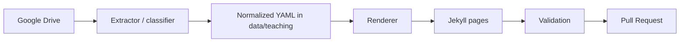

# System Architecture

## Components
- `automation/google_drive.py`: refreshes OAuth tokens and reads Drive metadata.
- `automation/naming.py`: infers slugs, course metadata, and material classification from Drive names.
- `automation/data_io.py`: loads and writes normalized YAML.
- `automation/rendering.py`: generates deterministic markdown for course pages and the teaching index.
- `automation/validation.py`: checks schema presence, link validity, generated-file freshness, and internal references.
- `automation/publish.py`: wraps local git plus `gh` PR creation for end-to-end local publishing.
- `.github/workflows/teaching-validation.yml`: acts as the CI producer for validation, coverage artifacts, and PR agent context generation.
- `.github/workflows/pr-agent-context-refresh.yml`: reruns PR context assembly on later review and check signals using append-mode refreshes.

## Boundaries
- Google integration is read-only.
- YAML in `data/teaching/` is the canonical repo-side source of truth.
- Markdown under `teaching/` and the managed block in `teaching.md` are generated artifacts.
- CI validates; it does not discover or sync from Drive.
- `pr-agent-context` consumes CI coverage artifacts and GitHub PR state; it does not mutate repository files.

## Data Flow

## Failure Handling
- Missing OAuth configuration returns exit code `2`.
- Upstream Drive failures return exit code `3`.
- Validation failures return exit code `1`.
- PR creation failures return exit code `4`.

## Determinism Rules
- Course ordering is stable: active first, then by academic period, then by title.
- Material ordering is stable: week, section, sort key, then title.
- Generated files are validated by exact content comparison, so stale artifacts fail validation.
